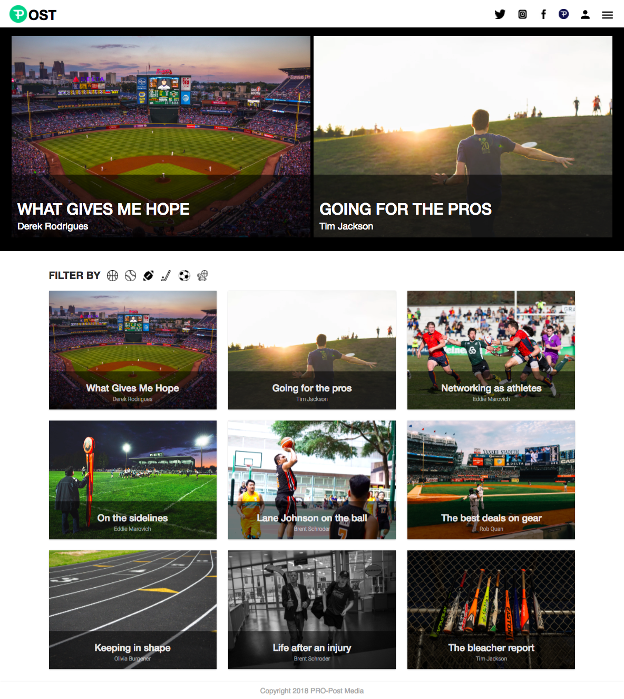
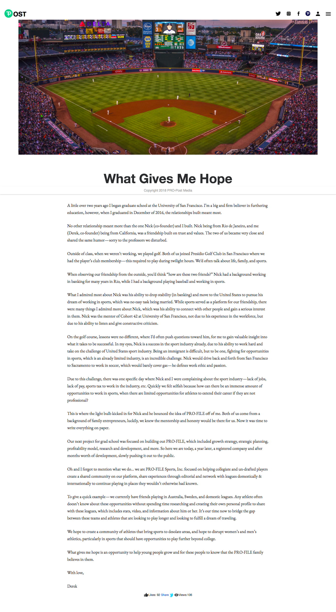
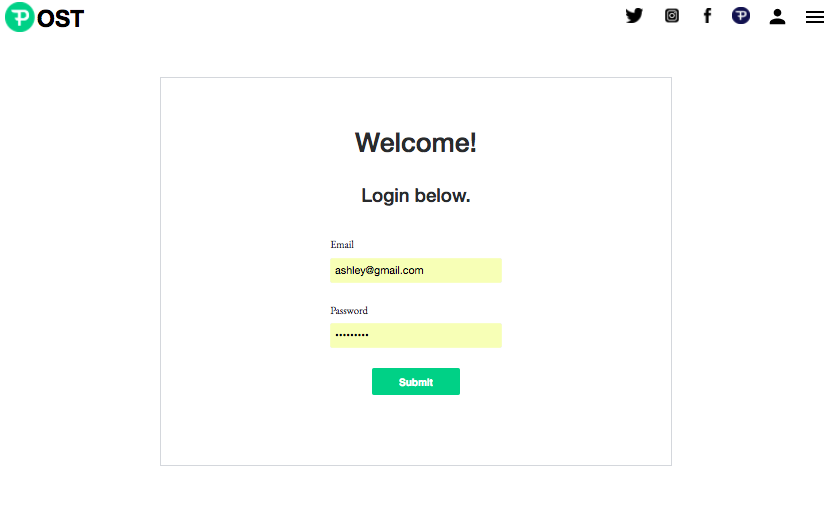
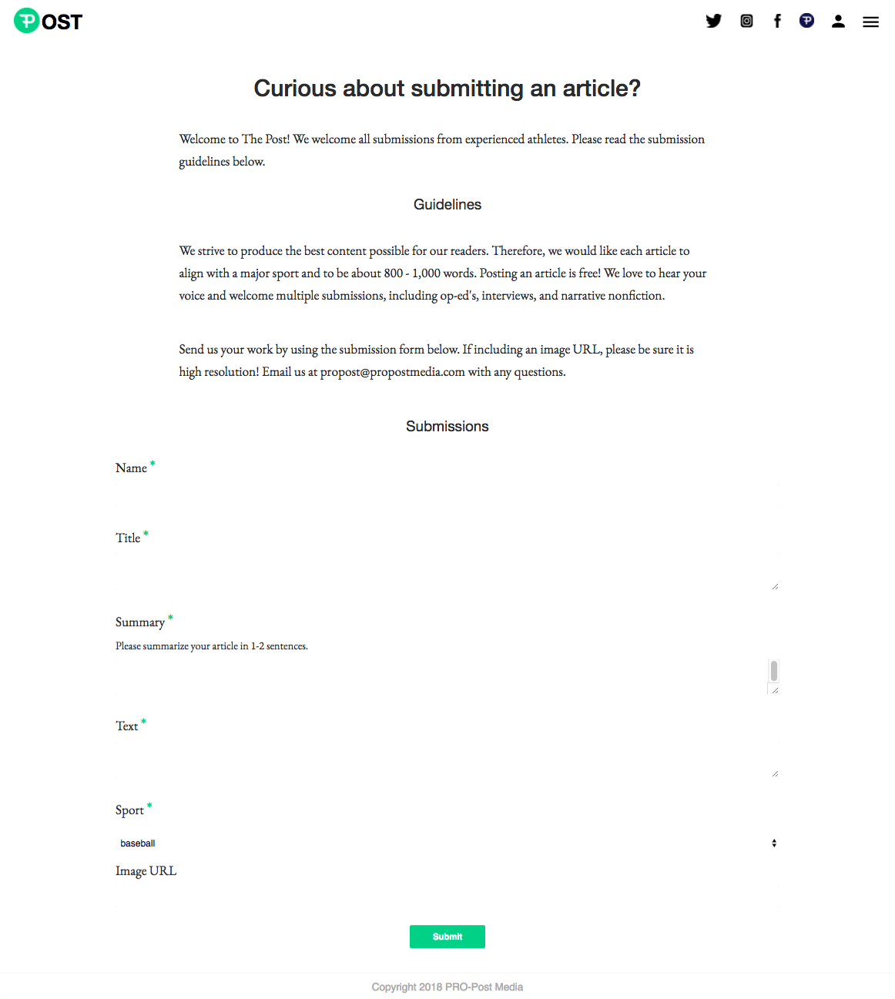
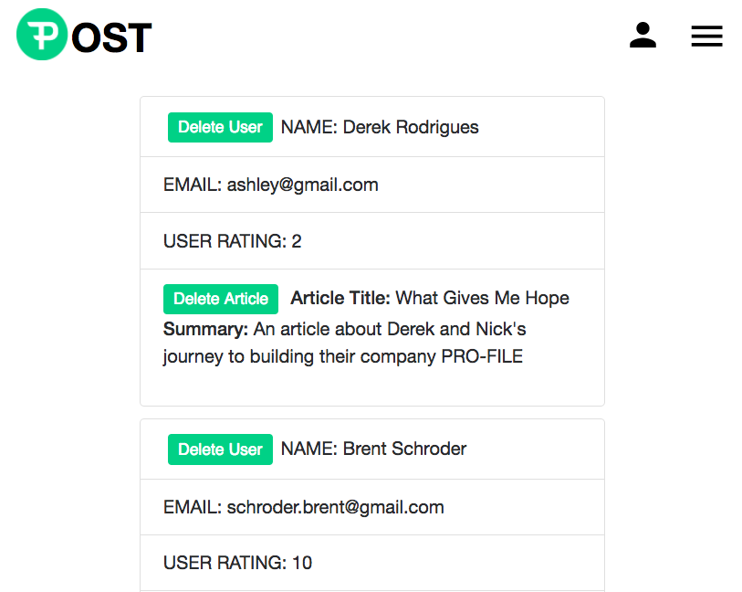
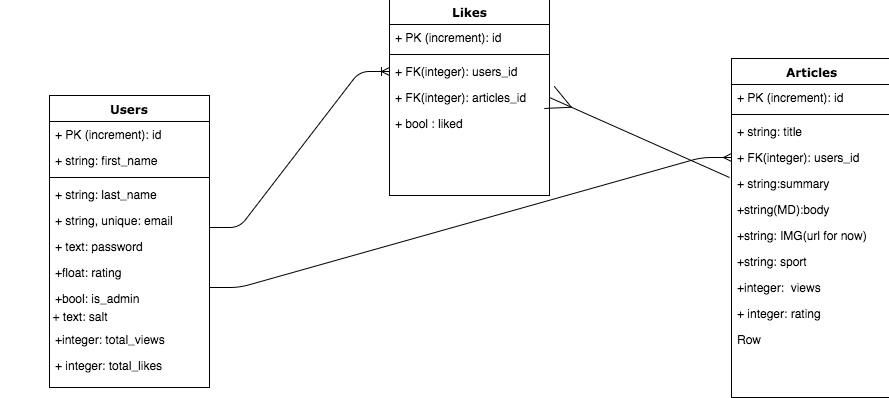

# The Post

[The Post](https://theprofilepost.herokuapp.com/) is a full-stack application that hosts sports-related editorial articles where athletes can also submit content to be published. The purpose of the Post is for athletes to share their thoughts and experiences, struggles and wins with a community of fellow sports enthusiasts. The application features the ability to filter articles by sport, publish an article, as well as an admin dashboard where articles and users can be deleted.

The Post was created as an addition to [PRO-FILE](http://pro-file.us/#/), a website that connects athletes and teams to foster networking and professional opportunities.

## Getting Started

Prerequisites: NodeJS

1. Clone the GitHub repository.
```
$ git clone https://github.com/ashleyamato/ThePost.git
```
2. Install dependencies and start in './react-backend'
```
$ cd react-backend
$ yarn install
$ createdb thepost
$ knex migrate:latest && knex seed:run
$ nodemon
```
3. Install dependencies and start in './pro-file-post'
```
$ cd pro-file-post
$ yarn install
$ yarn start
```
4. A browser should open http://localhost:3000/

## Navigating the Site

Articles populate the home page and are organized by most trending (a combination of likes and views). A user can filter articles by sport.



Articles are displayed in an easy-to-read format.



To submit an article, user can navigate to the sign up or login pages.



After logging in, the user can read submission guidelines and fill out a form with their editorial content. Their submission will automatically populate on the home page.



If the user is a designated administrator, they can enter the admin dashboard and view all site users. They can delete articles as well as delete users.



## Project Planning

Task Management: https://trello.com/b/KntLXos7/profile

Wireframes: https://drive.google.com/open?id=1C3xIMhnjJHsk-MNqIEeKczTdo2P5t8qg

Entity Relationship Diagram


## Technologies

* Javascript/ES6
* HTML
* CSS
* Material UI
* React & Redux
* Express
* Knex
* PostgreSQL

## Team Members
* [Olivia Burgener](https://github.com/oaburgener)
* [Rob Quan](https://github.com/TheRobQ)
* [Eddie Marovich](https://github.com/eddiemarovich)
* [Brent Shroder](https://github.com/Brumpo)
* [Tim Jackson](https://github.com/Mirtau)
